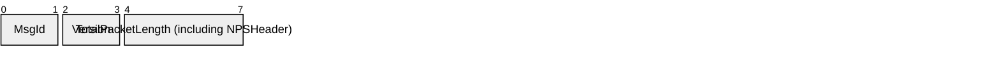
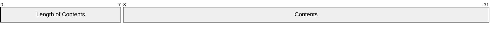
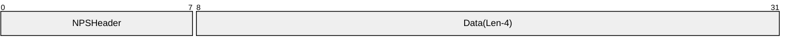

# Packets

## NPS

### NPSHeader

```mermaid
packet-beta
0-1: "MsgId"
2-3: "Version"
4-7: "TotalPacketLength (including NPSHeader)"
```

### Fixed Length Container

```mermaid
packet-beta
0-7: "Length of Contents"
8-31: "Contents"
```

### RawNPSPacket

```mermaid
packet-beta
0-7: "NPSHeader"
8-31: "Data(Len-4)"
```

### UserLoginRequest

```mermaid
packet-beta
0-7: "NPSHeader"
```
